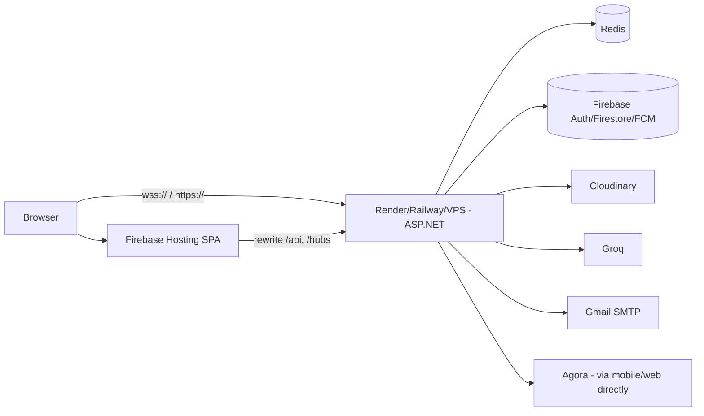

# TriChat — Deployment Guide

This document describes how to publish **TriChat** (Zalo-like chat app) to the
web while keeping the existing Docker workflow for the backend and continuing
to use the third-party APIs (Firebase, Cloudinary, Redis, Groq, SMTP, Agora).

> If you only want to test on a desktop browser without any cloud accounts,
> jump to **[§0 — Local quick test](#0--local-quick-test-no-cloud-required)**.

---

## Table of Contents

1. [Local quick test](#0--local-quick-test-no-cloud-required) — Docker Compose on your machine
2. [Prerequisites (cloud accounts)](#1--prerequisites)
3. [Secret strategy](#2--secret-strategy)
4. [Option A — Render.com (free tier)](#3-option-a--rendercom-free-tier)
5. [Option B — Railway.app](#4-option-b--railwayapp)
6. [Option C — Firebase Hosting (frontend) + Render (backend)](#5-option-c--firebase-hosting-frontend--render-backend-recommended)
7. [Option D — VPS (Hetzner / DigitalOcean / VietnamHost)](#6-option-d--vps-hetzner--digitalocean--vietnamhost)
8. [Troubleshooting](#7--troubleshooting)

---

## 0. Local quick test (no cloud required)

```bash
git clone https://github.com/<you>/trichat.git
cd trichat

cp .env.example .env
# then edit .env — only Firebase + Redis (we point at the local Redis container)

pwsh scripts/encode-firebase-key.ps1
# copy the printed base64 string into .env as FIREBASE_CREDENTIALS_BASE64

docker compose up --build
```

- Backend ↦ `http://localhost:5244/swagger`
- Redis ↦ `localhost:6379`

### Run the Flutter frontend on web (same host)

```bash
cd frontend
flutter pub get
flutter run -d chrome --dart-define=API_BASE_URL=http://localhost:5244
```

Chrome opens at e.g. `http://localhost:8123`. It will hit your backend on the
host's `localhost:5244` via the same machine.

---

## 1. Prerequisites

| Account          | Used for                              | Where to sign up                                             |
| ---------------- | ------------------------------------- | ------------------------------------------------------------ |
| GitHub           | Source control + auto-deploy          | [github.com](https://github.com/)                            |
| Firebase         | Firestore / Auth / FCM / Hosting      | [firebase.google.com](https://firebase.google.com/)          |
| Cloudinary       | Image & video storage                 | [cloudinary.com](https://cloudinary.com/)                    |
| Groq             | AI content moderation (free tier)     | [console.groq.com](https://console.groq.com/)                |
| Gmail            | Sending OTP emails (App Password)     | [myaccount.google.com](https://myaccount.google.com/apppasswords) |
| **Render** *or* **Railway** *or* **Fly.io** *or* **VPS** | Backend hosting                 | See each option below |

You also need:

- Flutter SDK ≥ 3.41.9
- Docker Desktop (for local + VPS path)

---

## 2. Secret strategy

The backend reads everything from `appsettings.json` (Redis, Firebase,
Cloudinary, Groq, SMTP). The Dockerfile never bakes this file into an image:
instead, `docker-entrypoint.sh` synthesises it from environment variables at
container start.

The Firebase service-account key is a binary JSON file. We **do not** ship it
in the image — instead we base64-encode it once and pass the result via the
`FIREBASE_CREDENTIALS_BASE64` env var. The entrypoint decodes it into
`FirebaseCredentials/serviceAccountKey.json` (the exact path the C# code
expects — relative to `AppContext.BaseDirectory`).

```bash
# Run once after you download a new key from Firebase Console.
pwsh scripts/encode-firebase-key.ps1
# → single-line base64 → paste into .env or Render's env UI.
```

> **Never commit** the raw `.env` file, the original `serviceAccountKey.json`,
> or any decoded copy. All three are listed in `.gitignore`.

---

## 3. Option A — Render.com (free tier)

### 3.1. Bring up Redis

Render does not bundle Redis natively. Use Upstash (free tier):

1. Sign up at [upstash.com](https://upstash.com/).
2. Create a Redis database, region `Singapore` for low latency in VN.
3. Copy the **Endpoint** + **Password** into the connection string
   `rediss://:<password>@<host>:<port>`.

### 3.2. Create the backend Web Service

1. Sign in at [render.com](https://dashboard.render.com/).
2. **New → Blueprint** is the easiest route — Render reads `render.yaml`
   from the repo and provisions the service for you. Add the file shown
   below to the repo root (only if you want auto-create):

   ```yaml
   # render.yaml
   services:
     - type: web
       name: trichat-backend
       runtime: docker
       rootDir: backend
       plan: free
       healthCheckPath: /swagger/index.html
       envVars:
         - key: Firebase__ProjectId
           sync: false
         - key: Firebase__CredentialsBase64
           sync: false
         - key: Redis__ConnectString
           sync: false
         - key: Cloudinary__CloudName
           sync: false
         - key: Cloudinary__ApiKey
           sync: false
         - key: Cloudinary__ApiSecret
           sync: false
         - key: Groq__ApiKey
           sync: false
         - key: Groq__Model
           value: llama-3.1-8b-instant
         - key: Smtp__Host
           value: smtp.gmail.com
         - key: Smtp__Port
           value: "587"
         - key: Smtp__Username
           sync: false
         - key: Smtp__Password
           sync: false
   ```

3. After the service is created, fill each `sync: false` env var in the
   Render dashboard's **Environment** tab. Use the values from your `.env`.

### 3.3. Free-tier caveats on Render

- **Cold starts**: free Web Services sleep after 15 min of inactivity.
  First request can take 30-60s. Heartbeat from the frontend after 12 min
  is recommended.
- **Region**: pick Singapore (`sin`) for Vietnam coverage.

### 3.4. Backend now lives at

`https://trichat-backend.onrender.com`

---

## 4. Option B — Railway.app

1. Sign in at [railway.app](https://railway.app/).
2. **New Project → Deploy from GitHub repo**.
3. When prompted for the root directory, pick `backend`.
4. Railway auto-detects the `Dockerfile` and builds the image.
5. **Variables** tab → paste every key from `.env`.
6. **+ New** → Database → **Redis** (Railway offers managed Redis as a
   plugin). Inject its connection string into `Redis__ConnectString`.
7. **Settings** → Generate Domain → note the URL, e.g.
   `https://trichat-backend.up.railway.app`.

---

## 5. Option C — Firebase Hosting (frontend) + Render (backend)  ← recommended

This is the cleanest split for a chat application:

| Layer            | Host                  | URL                                                       |
| ---------------- | --------------------- | --------------------------------------------------------- |
| Flutter Web SPA  | Firebase Hosting (CDN)| `https://trichat.web.app`                                 |
| ASP.NET Backend  | Render (Docker)       | `https://trichat-backend.onrender.com`                    |
| Firestore / FCM  | Firebase              | (already used by both layers)                             |
| Cloudinary / Groq / SMTP | 3rd-party      | (called by backend)                                       |
| WebSocket SignalR| Render (wss)          | `wss://trichat-backend.onrender.com/hubs/chat`            |

### 5.1. Deploy the backend to Render

Follow §3 above. Note the public URL, e.g.
`https://trichat-backend.onrender.com`.

### 5.2. Build the Flutter Web bundle

```bash
cd frontend
flutter pub get
flutter build web --release \
  --dart-define=API_BASE_URL=https://trichat-backend.onrender.com
```

The output goes to `frontend/build/web/`.

### 5.3. Configure Firebase Hosting

```bash
# from repo root
npm i -g firebase-tools
firebase login
firebase init hosting   # public dir = frontend/build/web
```

Add rewrites so Flutter SPA + API + WebSocket all share the same origin:

```jsonc
// firebase.json
{
  "hosting": {
    "public": "frontend/build/web",
    "ignore": ["firebase.json", "**/.*", "**/node_modules/**"],
    "rewrites": [
      { "source": "/api/**",   "destination": "https://trichat-backend.onrender.com/api/**" },
      { "source": "/hubs/**",  "destination": "https://trichat-backend.onrender.com/hubs/**" },
      { "source": "**",        "destination": "/index.html" }   // SPA fallback
    ],
    "headers": [
      {
        "source": "**/*.@(js|css)",
        "headers": [{ "key": "Cache-Control", "value": "max-age=31536000" }]
      }
    ]
  }
}
```

Now your Flutter web build runs at `https://<project>.web.app` and the
frontend can use the same-origin API path (the API config detects
`kIsWeb` → uses `window.location.origin`, so `/api/...` resolves locally).

After deploy:

```bash
firebase deploy --only hosting
```

### 5.4. (Optional) Mobile Android build

```bash
cd frontend
flutter build apk --dart-define=API_BASE_URL=https://trichat-backend.onrender.com
# → build/app/outputs/flutter-apk/app-release.apk
```

---

## 6. Option D — VPS (Hetzner / DigitalOcean / VietnamHost)

Use this if you want full control, custom domain, no cold-starts, ~$4-6 / month.

### 6.1. Provision a VPS

Pick any Ubuntu 22.04 LTS host with at least 1 GB RAM. SSH in.

```bash
sudo apt update && sudo apt install -y docker.io docker-compose-plugin nginx certbot python3-certbot-nginx
sudo usermod -aG docker $USER && newgrp docker
```

### 6.2. Clone & configure

```bash
git clone https://github.com/<you>/trichat.git /opt/trichat
cd /opt/trichat
cp .env.example .env
nano .env       # fill in secrets, REDIS_CONNECT_STRING=redis:6379
pwsh scripts/encode-firebase-key.ps1   # base64 → paste into .env
```

### 6.3. Bring up the stack

```bash
sudo docker compose up -d --build
sudo docker compose logs -f backend    # verify healthy
```

### 6.4. HTTPS termination with Nginx + Let's Encrypt

```nginx
# /etc/nginx/sites-available/trichat
server {
  server_name api.example.com;
  listen 80;

  location / {
    proxy_pass         http://127.0.0.1:5244;
    proxy_http_version 1.1;

    # WebSocket support (SignalR)
    proxy_set_header   Upgrade $http_upgrade;
    proxy_set_header   Connection "upgrade";
    proxy_set_header   Host $host;
    proxy_set_header   X-Real-IP $remote_addr;
    proxy_read_timeout 600s;
  }
}
```

```bash
sudo ln -s /etc/nginx/sites-available/trichat /etc/nginx/sites-enabled/
sudo nginx -t && sudo systemctl reload nginx
sudo certbot --nginx -d api.example.com
```

### 6.5. Deploy the Flutter Web build

Bundle once on your laptop, upload:

```bash
cd frontend
flutter build web --release --dart-define=API_BASE_URL=https://api.example.com
scp -r build/web user@your-vps:/var/www/trichat-web
```

Add another nginx vhost for `app.example.com` serving that directory.

---

## 7. Troubleshooting

### Backend won't start with `FileNotFoundException: Firebase credentials file not found`

You forgot to set `Firebase__CredentialsBase64` or the string is truncated.
Re-run `pwsh scripts/encode-firebase-key.ps1`, copy the **single-line**
base64 output into your env var.

### `No connection could be made because the target machine actively refused it` (Redis)

- Render free tier: confirm you set `Redis__ConnectString` to your Upstash URL.
- Docker Compose: confirm the `redis` service is up:
  `docker compose ps` — both should be `healthy`.

### Frontend shows `404 Not Found (with extra spaces)` on hard-refresh

Firebase Hosting must rewrite all unknown paths to `/index.html` (SPA mode).
Verify the rewrites block in §5.3.

### SignalR keeps reconnecting on web

1. Check the browser console — if it shows
   `WebSocket connection to wss://… failed`, your backend is down or your
   hosting plan doesn't expose WebSockets. Render + Railway both do; if you
   proxy through Cloudflare, enable the **WebSockets** toggle.
2. The frontend URL config (`api_config.dart`) must use `wss://` in
   production (browser WebSockets require TLS).

### Voice / video calls crash on web with `iris-rtc` error

Confirm `web/index.html` contains:

```html
<script src="https://download.agora.io/sdk/release/iris-rtc_4.2.0.js"></script>
```

If you target a different Agora SDK version, update both the script URL and
the Dart plugin's pinned version.

---

## Summary diagram


